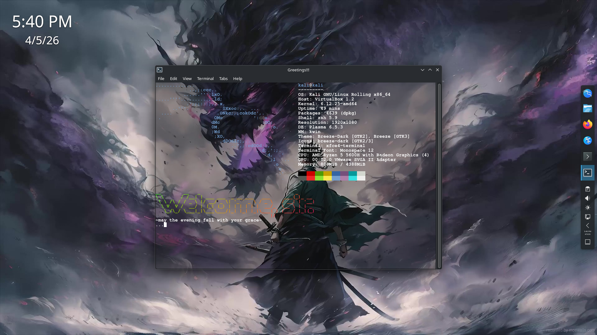

# Linux Terminal Greeter 🚀

A customizable Linux startup greeter that automatically opens a terminal on login, displays system information, ASCII art, and a poetic time-based greeting.

<p align="center">
  
</p>

---

## ✨ Features

- Automatic terminal launch on login
- Time-based dynamic greetings
- System information via **neofetch**
- Styled banner using **figlet + lolcat**
- Lightweight and customizable
- Simple installation

---

## ⚠️ Requirements

Tested on **XFCE-based Linux systems** (Kali Linux / Xubuntu).

---

## 📦 Installation

Clone repository:

```bash
git clone https://github.com/y2-code/linux-terminal-greeter.git
cd linux-terminal-greeter
```
Install Required Packages:

```bash
sudo apt update
sudo apt install neofetch figlet lolcat python3
```
Make Scripts Executable:

```bash
chmod +x startup.sh install.sh
```
Install Autostart Configuration:

```bash
./install.sh
```
Reboot Your System:

 ```bash
reboot
```
## 🚀 Usage

Once installed, your terminal will greet you automatically on login. Enjoy dynamic messages, system stats, and ASCII art every time you start your Linux session!  

> **Note:** At the end of the greeting, the terminal will display "Press Enter to exit...". The preview image shows "..." for aesthetics.

## 🤝 Contributing

Contributions are welcome! Feel free to submit issues or pull requests to improve the project.

## 📄 License

This project is MIT Licensed — see the LICENSE
 file for details.
